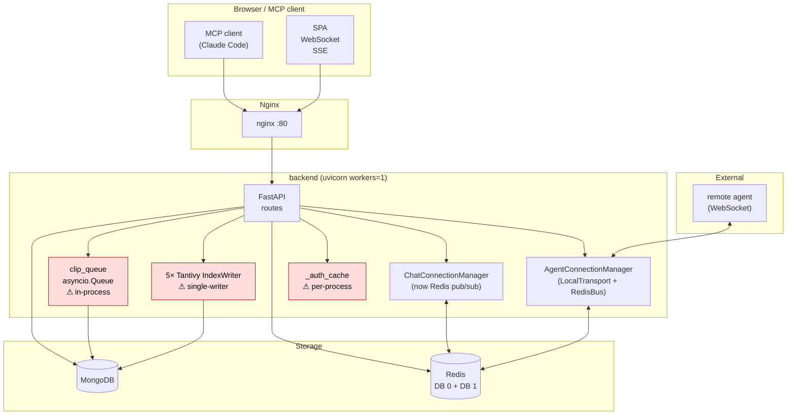
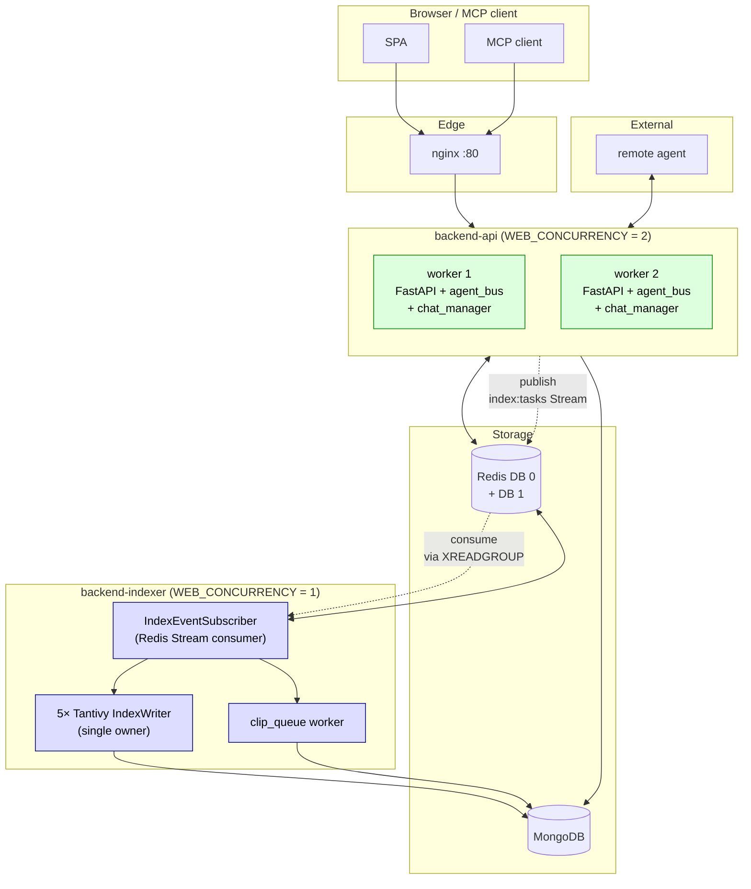
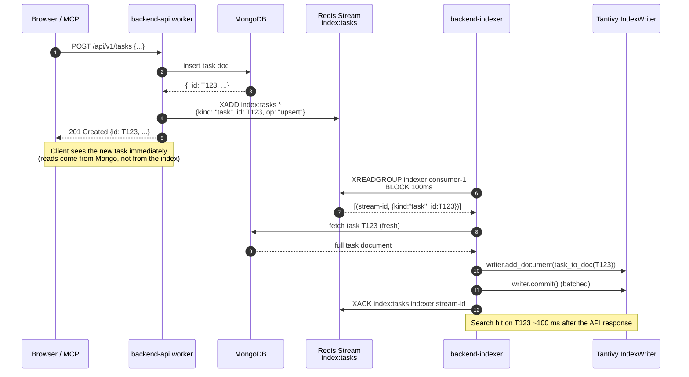
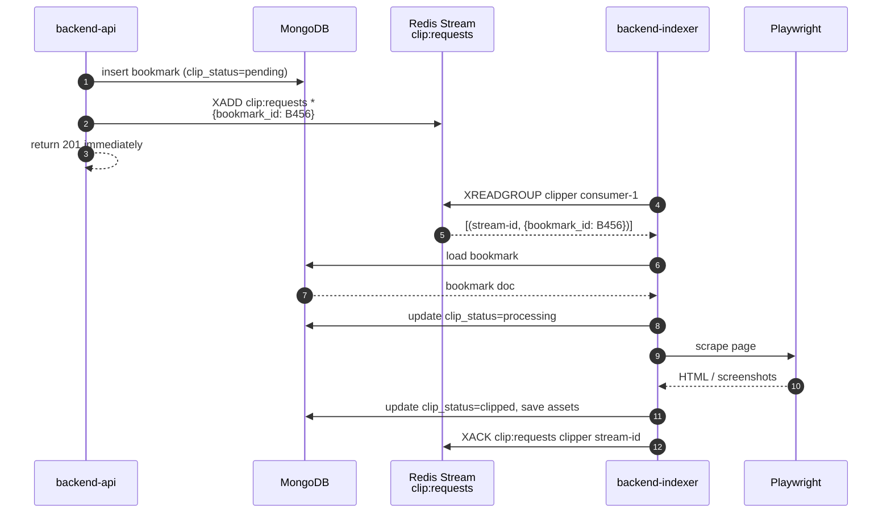
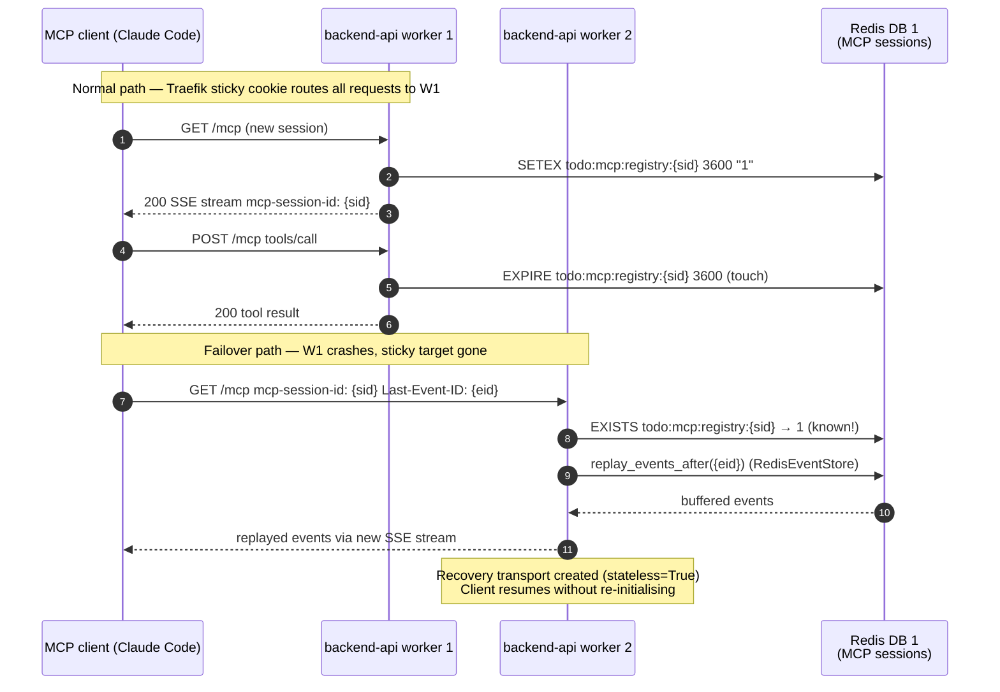
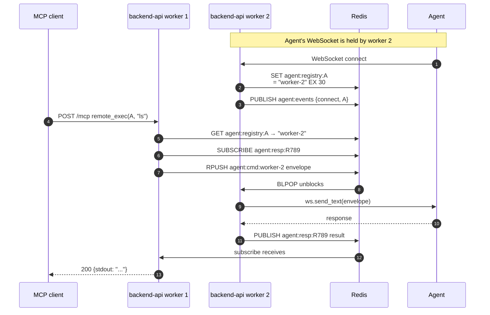
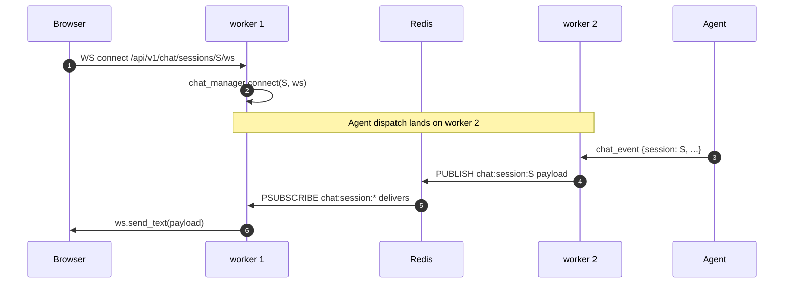

# Multi-Worker Sidecar Architecture

**Status**: Design proposal — pending review
**Author**: 2026-04-09 session
**Tracks**: [P1 multi-worker](../../README.md#tasks), `task:69d63d43ed4c2fd5198dffee`
**Supersedes**: the partial Option A implementation in commits `ceb8a84` … `6b3d515`

---

## 1. Why this design exists

The product needs `WEB_CONCURRENCY > 1` for parallel ingest workloads
(bookmark thumbnail bursts being the immediate driver). The session
that started P1 only fixed the **agent transport** layer; the rest of
the backend still assumes single-writer ownership of several shared
resources, so flipping `WEB_CONCURRENCY` to 2 today would corrupt
indexes, double-claim bookmarks, and silently lose chat messages.

This document specifies the architecture that lets us turn
multi-worker on **safely** by extracting the single-writer subsystems
into a dedicated sidecar container.

### Goals

- ✅ Run the public API surface (HTTP / WebSocket / MCP) at
  `WEB_CONCURRENCY ≥ 2` without race conditions, index corruption,
  or duplicate work.
- ✅ Keep the current developer experience (`docker compose up -d`,
  fakeredis-backed unit tests, no extra services to install).
- ✅ Preserve read-after-write semantics for the operations that
  need them (admin UI shows newly-created tasks immediately).
- ✅ Stay within CLAUDE.md rules: no silent fallbacks, no error
  hiding, loud failure on missing dependencies.
- ✅ Roll back to single-process mode with a single env var if a
  bug surfaces in production.

### Non-goals

- ❌ Multi-host horizontal scaling (one Docker Compose deployment).
- ❌ Per-document sharding of the Tantivy indexes.
- ❌ Hot-failover of the indexer sidecar (planned restart only).
- ❌ Eliminating the in-process `_auth_cache` (TTL shortening is
  the chosen mitigation — see §11).

---

## 2. Current state (broken when `WEB_CONCURRENCY=2`)



The components in red **break** if a second worker is added:

| Component | What breaks when `WEB_CONCURRENCY=2` |
|---|---|
| 5 × Tantivy `IndexWriter` | Each worker holds an exclusive write lock on the same `search_index*` volume → second worker fails to start, or worse, both workers race and corrupt the index segment files. |
| `clip_queue` (in-process `asyncio.Queue`) | Each worker runs `recover_pending` at startup → both pick up the same pending bookmarks → 2× Playwright load + duplicate clip writes. |
| `_auth_cache` (per-process LRU) | API key revocation reflects in only one worker until the cache TTL expires (currently 5 min). Acceptable but visible. |
| ~~`prometheus_client` default registry~~ | **Removed entirely in commit `ecaba9d`.** No scraper was configured anywhere, so the instrumentation was dead code. If we ever add Prometheus we will re-add it with the multi-worker pattern (worker_id label + replica deployment) from day one rather than bolting it on. |

The components that already **work** at `WEB_CONCURRENCY > 1`:

- `AgentConnectionManager` + `RedisAgentBus` — fixed in commits `ceb8a84` (refactor) and `302698a` (`__send_raw__` / GC bugs)
- `ChatConnectionManager` — fixed in `6b3d515` (Redis pub/sub fan-out)
- SSE event broadcast (`todo:events`) — already Redis pub/sub
- WebAuthn challenge / refresh JWT JTI / SSE ticket — all Redis-backed
- OAuth state cookie — client-side, no shared state

---

## 3. Target architecture



### Key decisions

1. **Two container kinds, not five.** All single-writer subsystems
   collapse into one `backend-indexer` sidecar so we add a single
   container line to `docker-compose.yml`. This keeps the deploy
   story simple at the cost of slightly less isolation between the
   indexers and the clip queue (acceptable — they already share
   filesystem volumes today).

2. **Shared image, divergent commands.** The sidecar is the **same
   Docker image** as the API, just started with a different command
   and `ENABLE_API=0 ENABLE_INDEXERS=1 ENABLE_CLIP_QUEUE=1`. No
   second `Dockerfile`, no duplication of dependency installs. Build
   time stays at one image.

3. **Communication via Redis Streams (`XADD` / `XREADGROUP`).** API
   workers `XADD` "please reindex this id" notifications onto
   `index:tasks`; the sidecar consumes via a consumer group so
   delivery is at-least-once with explicit acknowledgement. Pub/sub
   was rejected because Redis pub/sub has no buffering — if the
   sidecar restarts, in-flight notifications would be lost.

4. **Mongo is still the source of truth.** API writes go directly
   to MongoDB and only **then** publish a notification. The
   indexer reads the document fresh from MongoDB before indexing,
   so even if a notification is dropped the next reindex from a
   periodic catch-up loop will pick it up. **The notification is
   a hint, not the data.**

5. **Read-after-write is preserved for the cases that need it.**
   The admin UI calls Mongo directly (not the index), so newly
   created tasks / bookmarks / documents are visible immediately.
   Only **search results** lag behind, and that lag is bounded by
   the indexer's consumer loop interval (~100 ms in steady state).

---

## 4. Component responsibilities

### 4.1 `backend-api` (workers = N)

**Owns:**
- All HTTP / WebSocket / MCP routes
- `AgentConnectionManager` (composes `LocalAgentTransport` + `RedisAgentBus`)
- `ChatConnectionManager` (Redis pub/sub fan-out)
- Auth / authorization, token issuance, OAuth flows
- Direct MongoDB writes for all CRUD
- **Publishes** to `index:tasks` after every CRUD that affects searchable text
- **Publishes** to `clip:requests` after every bookmark create/import

**Does NOT own:**
- ❌ Tantivy `IndexWriter` (read-only `Index.searcher()` is fine)
- ❌ `clip_queue` background worker
- ❌ `recover_*` startup hooks that mutate global state
- ❌ Periodic flush loops

**Startup hooks gated by env vars:**
- `ENABLE_INDEXERS=0` → skip `_init_search_index` registry
- `ENABLE_CLIP_QUEUE=0` → skip `clip_queue.start()` and `recover_pending`
- `ENABLE_API=1` → mount FastAPI routes (default; sidecar sets this to 0)

### 4.2 `backend-indexer` (workers = 1, single instance)

**Owns:**
- All 5 Tantivy `IndexWriter` instances
- `clip_queue` worker
- `index:tasks` Redis Stream consumer (consumer group `indexer`)
- `clip:requests` Redis Stream consumer (consumer group `clipper`)
- Periodic full reindex / compaction loops (existing `flush_loop`s)
- Its own `/health` endpoint (no `/metrics` — Prometheus instrumentation was removed in `ecaba9d`)

**Does NOT own:**
- ❌ HTTP API routes (`ENABLE_API=0`)
- ❌ MCP server mount
- ❌ WebAuthn / OAuth state
- ❌ Agent WebSocket endpoint

**Startup hooks gated by env vars:**
- `ENABLE_API=0` → skip router mounting, mount only `/health`
- `ENABLE_INDEXERS=1` → run `_init_search_index` registry, attach
  `flush_loop` tasks
- `ENABLE_CLIP_QUEUE=1` → run `clip_queue.start()` and `recover_pending`

---

## 5. Communication patterns

### 5.1 Index write flow (CRUD that affects search results)



Key properties:
- **At-least-once delivery** via consumer group + XACK. A crashed
  indexer's pending entries are reclaimed by `XAUTOCLAIM` on restart.
- **Notification carries no data**, only `(kind, id, op)`. The indexer
  always re-reads from Mongo, so a notification cannot poison the
  index even if the API mis-serializes it.
- **Idempotent writes**. `op: "upsert"` reads the current Mongo state
  and replaces the existing index entry. Replaying the same
  notification produces the same result.

### 5.2 Clip queue flow (bookmark create / batch import)



Key properties:
- The legacy `recover_pending()` startup hook becomes **periodic
  catch-up** in the indexer: every 60 s it scans for
  `clip_status in {pending, processing}` rows older than 5 min and
  re-`XADD`s them. This recovers from notifications dropped due
  to indexer restarts AND from genuine processing failures.
- Because only **one** indexer container runs, no double-claim.
  When we eventually need to scale the indexer, the consumer group
  semantics already give us safe sharding.

### 5.3 MCP session continuity (multi-worker)



Key components:

| Component | Location | Purpose |
|---|---|---|
| `RedisSessionRegistry` | `app/mcp/session_registry.py` | Cross-worker session existence map. Key: `todo:mcp:registry:{sid}` |
| `RedisEventStore` | `app/mcp/session_store.py` | Buffers SSE events for `Last-Event-ID` replay across workers |
| `ResilientSessionManager` | `app/mcp/session_manager.py` | Extends upstream manager with registry-aware recovery |

**Decision logic for unknown sessions:**

```
Request for session {sid} arrives at worker B
├── {sid} in local _server_instances?  →  handle directly (normal path)
├── registry.exists({sid})?
│   ├── Yes  →  cross-worker recovery: create local transport (stateless=True)
│   │           RedisEventStore replays missed events on GET reconnect
│   └── No   →  404 Session not found  (expired / forged session)
```

**Why not proxy to the owning worker?**

MCP POST responses are sent inline in the POST response body (not via the
SSE stream), so any worker can process a POST independently in stateless
recovery mode.  The GET SSE stream is for server-initiated *notifications*
only, not for request–response.  Traefik sticky routing (`_sticky_mcp`
cookie) prevents cross-worker POSTs in normal operation; the registry only
activates for crash/restart/scale-in scenarios.

**Registry TTL and expiry:**

The registry entry TTL is 1 hour (matching `RedisEventStore`).  It is
refreshed on every request handled by the owning worker via `touch()`.
An idle session expires automatically; no explicit cleanup is required
during graceful shutdown (though the manager does call `unregister()` when
the transport terminates cleanly).

**Legacy mode (no registry):**

Pass `session_registry=None` to `ResilientSessionManager` to restore the
pre-registry "recover every unknown session" behaviour.  Useful for unit
tests that do not wire up Redis.

### 5.4 Agent transport flow (unchanged from current `RedisAgentBus`)



This is the **already-implemented** path from the previous session
(`6b3d515`). Documented here so the full multi-worker picture is
in one place.

### 5.5 Chat WebSocket fan-out (unchanged from `6b3d515`)



---

## 6. Configuration

### Environment variables

| Variable | Default | API | Indexer | Purpose |
|---|---|---|---|---|
| `ENABLE_API` | `1` | `1` | `0` | Mount FastAPI routes (otherwise only `/health`) |
| `ENABLE_INDEXERS` | `1` | `0` | `1` | Run Tantivy `IndexWriter` initialisation + flush loops |
| `ENABLE_CLIP_QUEUE` | `1` | `0` | `1` | Run `clip_queue.start()` and `recover_pending` |
| `WEB_CONCURRENCY` | `1` | `2` | `1` | uvicorn worker count (1 for indexer is mandatory) |
| `INDEXER_STREAM_KEY` | `index:tasks` | (publisher) | (consumer) | Redis Stream name |
| `INDEXER_CONSUMER_GROUP` | `indexer` | n/a | (consumer group) | XREADGROUP group name |
| `INDEXER_BLOCK_MS` | `100` | n/a | (loop) | XREAD block timeout (lower = lower index lag, higher = lower idle CPU) |
| `INDEXER_BATCH_SIZE` | `64` | n/a | (loop) | Max entries per XREADGROUP call |
| `MCP_AUTH_CACHE_TTL_SECONDS` | **30** (was 300) | tuned down | n/a | Shorten the per-worker auth cache so revocations propagate within 30 s |

### docker-compose.yml additions

```yaml
services:
  backend:        # renamed → backend-api in next iteration
    environment:
      - WEB_CONCURRENCY=${WEB_CONCURRENCY:-2}
      - ENABLE_API=1
      - ENABLE_INDEXERS=0
      - ENABLE_CLIP_QUEUE=0
      - MCP_AUTH_CACHE_TTL_SECONDS=30
    # ... existing config

  backend-indexer:
    image: same-as-backend  # built from the same Dockerfile
    container_name: todo-backend-indexer
    environment:
      - <same MONGO/REDIS/SECRET env as backend-api>
      - WEB_CONCURRENCY=1
      - ENABLE_API=0
      - ENABLE_INDEXERS=1
      - ENABLE_CLIP_QUEUE=1
    volumes:
      - search_index:/app/search_index
      - search_index_docsites:/app/search_index_docsites
      - search_index_bookmarks:/app/search_index_bookmarks
      - search_index_knowledge:/app/search_index_knowledge
      - search_index_documents:/app/search_index_documents
      - bookmark_assets:/app/bookmark_assets
    depends_on:
      mongo: { condition: service_healthy }
      redis: { condition: service_healthy }
    deploy:
      resources:
        limits:
          cpus: "1"
          memory: 1G
    networks:
      - todo-net
```

The `backend-api` service **drops** the index volume mounts (it
no longer writes to them; reads happen via Redis-backed search
service caches if needed). This explicit volume separation is the
defence-in-depth that prevents an accidental `ENABLE_INDEXERS=1`
on the API workers from corrupting the index.

### nginx.conf additions

No changes required. The `/metrics` location block was removed
along with the Prometheus instrumentation (commit `ecaba9d`).

---

## 7. Migration plan (PR breakdown)

### PR 1 — Subsystem env-gating (no behaviour change)

- Add `ENABLE_API`, `ENABLE_INDEXERS`, `ENABLE_CLIP_QUEUE` settings
  to `core/config.py` (all default `True`).
- Wrap `_init_search_index` loop in `if settings.ENABLE_INDEXERS`.
- Wrap `clip_queue.start()` and `recover_pending` in
  `if settings.ENABLE_CLIP_QUEUE`.
- Wrap router `include_router` calls in `if settings.ENABLE_API`.
- Add `/health` always (regardless of `ENABLE_API`) so both
  containers can be health-checked by docker-compose.
- Test: existing 1245 tests stay green at default config.
- **Risk**: zero (defaults preserve current behaviour).

### PR 2 — Index notification contract

- Add a `services.index_notifications` module:
  - `notify_task_upserted(task_id: str)`
  - `notify_task_deleted(task_id: str)`
  - … same for bookmark / document / knowledge / docsite
- Each helper does `XADD index:tasks * kind=task id=... op=upsert`.
- The publisher is **a no-op when `ENABLE_INDEXERS=1`** in the
  same process (the indexer is still in-process, no need to
  notify). When `ENABLE_INDEXERS=0`, it `XADD`s as above.
- Wire publishers into the existing CRUD endpoints (REST and MCP)
  immediately after the Mongo write commits.
- Test: unit test that `XADD` happens after a successful insert.
- **Risk**: low (publishers are a one-line addition; no existing
  index path changes).

### PR 3 — Indexer consumer

- Add `services.indexer_consumer` module:
  - `IndexerConsumer.start()` — XGROUP CREATE (idempotent),
    spawn the consume loop
  - `IndexerConsumer.stop()` — graceful drain
  - `_consume_loop()` — XREADGROUP → fetch from Mongo →
    indexer write → XACK
  - `_periodic_recover()` — XAUTOCLAIM stale pending entries
- Wire into `main.py` lifespan when `ENABLE_INDEXERS=1`.
- Test: mock Redis stream + verify the consumer fetches from Mongo
  and writes via `SearchIndexer.set_instance(...).index(...)`.
- Existing search tests still use the in-process indexer (env
  default `ENABLE_INDEXERS=1` AND `ENABLE_API=1` in test mode).
- **Risk**: medium (new code, but no production switch yet).

### PR 4 — Sidecar container in docker-compose

- Add the `backend-indexer` service entry shown in §6.
- Update `Dockerfile` to make `WEB_CONCURRENCY` the only command
  argument (the env vars decide what to run).
- Document the deployment pattern in `README.md`.
- Production rollout: deploy the sidecar with **default env vars
  matching current behaviour** (`ENABLE_API=1` + `ENABLE_INDEXERS=1`
  on the same container, indexer container does NOT yet exist).
- **Risk**: zero (no behaviour change; the indexer compose entry
  exists but is not yet pointed at by env defaults).

### PR 5 — Switch the default

- Set `backend-api.environment.ENABLE_INDEXERS=0` and
  `ENABLE_CLIP_QUEUE=0` in docker-compose.yml.
- Add the `backend-indexer` service entry with
  `ENABLE_API=0 ENABLE_INDEXERS=1 ENABLE_CLIP_QUEUE=1`.
- Bump `WEB_CONCURRENCY` default to `2` for the API container.
- **Manual smoke test**: create a task / bookmark / knowledge entry,
  observe it in Mongo immediately, observe it in search results
  within ~1 s. Verify chat and remote agent RPCs work across
  workers.
- **Risk**: high — this is the production cutover. Roll back by
  setting `WEB_CONCURRENCY=1`, `ENABLE_INDEXERS=1`,
  `ENABLE_CLIP_QUEUE=1` on the API container and removing the
  sidecar service. No data migration needed.

### PR 6 — `_auth_cache` TTL shortening

- `MCP_AUTH_CACHE_TTL_SECONDS`: 300 → 30 so API key revocations
  propagate to every worker within 30 s regardless of which worker
  cached the authentication result.
- **Risk**: low (config only).

Prometheus observability used to be part of this PR but was removed
entirely in commit `ecaba9d` because no scraper was configured and
the instrumentation had become dead weight. If a scraper is added
later, the multi-worker pattern (worker_id label + replica
deployment or the `prometheus_client` multiprocess mode) should be
designed into the re-introduction from day one.

---

## 8. Test strategy

| Layer | Coverage | Tooling |
|---|---|---|
| Unit | Each new module (`indexer_consumer`, `index_notifications`) tested in isolation with fakeredis | pytest + `fakeredis.aioredis` |
| Integration | API + Mongo + fakeredis: insert task → assert `XADD` happened on the stream | pytest |
| Integration | Indexer consumer: inject XADD payload → assert Tantivy write | pytest |
| End-to-end | Full docker-compose with the sidecar running, real Redis Streams, real Tantivy | docker-compose.test.yml |
| Load test | 24 h soak with `WEB_CONCURRENCY=2`, mixed bookmark imports + chat sessions + remote_exec calls | locust + container logs (no Prometheus dashboards — instrumentation was removed) |

The **end-to-end docker-compose test** is the gating test for
PR 5: it must run for at least 24 h without index corruption,
duplicate clips, lost chat messages, or memory leaks before we
flip the production default.

The existing 1245 unit tests cover the API + agent_bus +
chat_manager paths and should continue to pass after every PR.
PR 1 explicitly adds a "default config" smoke test that boots the
manager with all `ENABLE_*=1` to confirm we have not broken the
single-process path.

---

## 9. Operational considerations

### Health checks

- `backend-api`: existing `/health` (Mongo + Redis ping)
- `backend-indexer`: `/health` returns OK only when:
  - the indexer consumer task is running
  - the clip queue worker task is running
  - Mongo + Redis ping succeed
- docker-compose `restart: unless-stopped` for both

### Restart semantics

- **API restart**: in-flight RPCs drain via the existing
  `agent_manager.start_shutdown` + `drain` machinery; chat WebSockets
  drop and reconnect; sticky session is unnecessary because the
  agent bus reroutes via Redis.
- **Indexer restart**: `XAUTOCLAIM` on startup reclaims any pending
  entries the previous instance was processing. Consumer offset
  is preserved by Redis, no state loss.
- **Both restart together** (deploy): standard docker-compose
  rolling restart works because the API workers buffer index
  notifications in the Redis Stream (max length capped at 100k
  entries).

### Capacity planning

- Default deployment: 2 × API worker × ~512 MB + 1 × indexer × ~1 GB.
- The indexer is the memory hot spot because all 5 Tantivy writers
  hold heap buffers (50 MB × 5 = 250 MB before doc data).
- Bookmark batch import: 1 × Playwright Chromium per indexer
  (peaks at ~600 MB during heavy clip burst). The clip queue is
  rate-limited via existing `_THROTTLE_SECONDS=1` so the indexer
  does not OOM.

### Rollback

| Failure | Action |
|---|---|
| Indexer container won't start | `docker compose restart backend-indexer`; logs include the failing init step |
| Indexer crash loop | `docker compose stop backend-indexer`; set `ENABLE_INDEXERS=1 ENABLE_CLIP_QUEUE=1 WEB_CONCURRENCY=1` on the API container; restart the API. Search will still work with the in-process indexer until the sidecar is debugged. |
| Index corruption | Stop both containers, run the existing rebuild path (`FORCE_REINDEX=1`), restart |
| Stream backlog explosion | Operator can `XLEN index:tasks`; if > 50k, scale the indexer block timeout down (`INDEXER_BLOCK_MS=10`) or temporarily increase the consumer batch size |

---

## 10. Open questions / decisions needed

| # | Question | Recommendation |
|---|---|---|
| Q1 | One sidecar (indexer + clip_queue) or two? | **One** — simpler compose, same VM, both already share the bookmark_assets volume |
| Q2 | Stream backpressure: max length policy (`MAXLEN ~`) on `XADD`? | **Yes**, cap at 100k entries (`MAXLEN ~ 100000`) so a stuck indexer cannot fill Redis memory |
| Q3 | Read-after-write delay for search: acceptable bound? | **1 second p99** (consumer block 100 ms + Tantivy commit ~500 ms worst case) |
| Q4 | Sync indexer in test mode? | **Yes** — when `TESTING=1`, ENABLE_INDEXERS in the same process so existing tests do not need to wait for the consumer loop |
| Q5 | ~~Prometheus multiprocess mode vs separate `/metrics`?~~ | **Resolved by removal** — commit `ecaba9d` deleted all Prometheus instrumentation (no scraper exists in the deployment). Not a multi-worker blocker anymore. |
| Q6 | `_auth_cache`: TTL shorten or Redis-back? | **TTL shorten** (300 → 30 s). Acceptable for an internal small-team tool; Redis-backing it would need invalidation broadcasts and is over-engineered for the threat model. |
| Q7 | Indexer scaling: when do we need > 1 indexer? | **Out of scope**. When the bookmark clip queue regularly exceeds the throughput of one Playwright instance, switch the indexer to consumer-group sharding (multiple consumers in the same group) — Redis Streams already supports this. |
| Q8 | Catch-up loop frequency? | **60 s** for periodic XAUTOCLAIM scan; **5 min idle** before reclaiming a pending entry from another consumer |

---

## 11. Risks

| # | Risk | Likelihood | Mitigation |
|---|---|---|---|
| R1 | Read-after-write semantics broken for users who expect newly-created items to appear in search immediately | High | Document the 1 s lag in the API response; the admin UI reads from Mongo not search, so the lag is invisible for the common case |
| R2 | Indexer crashes silently and the stream backlog grows unbounded | Medium | `MAXLEN ~ 100000` cap + periodic `XLEN index:tasks` check from the indexer's `/health` endpoint (returns 503 if lag > 10k) so docker-compose restart triggers automatically |
| R3 | Notification / consumption schema drift between API and indexer (they ship independently in theory) | Medium | Keep both in the **same Docker image** so they always share the same code version. Document this in `Dockerfile` |
| R4 | Existing in-process index writes (used by tests) and stream-based writes diverge subtly | High | PR 1's test gate: every existing search test runs against both the in-process and the consumer-driven indexer. CI must run both modes |
| R5 | docker-compose newcomers do not realise the indexer container is mandatory | Medium | `README.md` deployment section explicitly says "the indexer sidecar is required when WEB_CONCURRENCY > 1"; nginx returns 503 from `/health` if the indexer is missing |
| R6 | `MCP_AUTH_CACHE_TTL_SECONDS=30` is still long enough for a stale-cache window after API key revocation | Low | Document the 30 s window in the admin UI's "revoke key" confirmation dialog |
| R7 | The 24 h soak test in CI is expensive | Medium | Run it only on release branches, not on every PR |
| R8 | Tantivy 5 indexes consume more disk because the indexer writes more frequently | Low | The current `flush_loop` already commits every 60 s; the consumer-driven path commits in batches no more frequently than that |

---

## 12. Definition of Done for P1

The P1 task is complete when **all** of the following hold:

- [ ] PR 1 through PR 6 merged
- [ ] `WEB_CONCURRENCY=2` is the default in `docker-compose.yml`
- [ ] `backend-indexer` sidecar runs in production
- [ ] 24 h soak test passes with mixed workload
- [ ] No unit / integration test regressions
- [ ] Operator runbook updated (`docs/runbook/multi-worker.md`)
- [ ] Rollback procedure documented and tested in staging
- [ ] CLAUDE.md updated to reflect the new deployment topology

The previous "completed" P1 (single commit, `WEB_CONCURRENCY=1`)
did NOT meet this DoD and was retroactively reopened on
2026-04-09 — see `task:69d63d43ed4c2fd5198dffee` comments.

---

## Appendix A — File-level changes summary

| Path | PR | Change |
|---|---|---|
| `backend/app/core/config.py` | 1, 6 | `ENABLE_API`, `ENABLE_INDEXERS`, `ENABLE_CLIP_QUEUE`, `INDEXER_*`, lowered `MCP_AUTH_CACHE_TTL_SECONDS` (300 → 30) |
| `backend/app/main.py` | 1 | Wrap startup hooks in `if settings.ENABLE_*` |
| `backend/app/services/index_notifications.py` (new) | 2 | XADD helper module |
| `backend/app/services/indexer_consumer.py` (new) | 3 | Stream consumer + recover loop |
| `backend/app/api/v1/endpoints/{tasks,bookmarks,knowledge,documents,docsites}.py` | 2 | Call `index_notifications.notify_*` after Mongo writes |
| `backend/app/mcp/tools/{tasks,bookmarks,knowledge,documents}.py` | 2 | Same pattern for MCP tool writes |
| `backend/Dockerfile` | 4 | `CMD` becomes a thin shell wrapper that respects `ENABLE_*` |
| `docker-compose.yml` | 4, 5 | New `backend-indexer` service; default env on `backend` flips to API-only |
| `nginx/nginx.conf` | — | No changes (the `/metrics` block was removed in commit `ecaba9d`) |
| `backend/tests/integration/test_indexer_consumer.py` (new) | 3 | Stream → fetch → write integration test |
| `backend/tests/integration/test_multi_worker_e2e.py` (new) | 5 | docker-compose-driven 24 h smoke |
| `backend/tests/unit/test_chat_manager.py` | (existing, done) | `6b3d515` |
| `backend/tests/unit/test_agent_bus.py` | (existing, done) | `302698a` |
| `docs/runbook/multi-worker.md` (new) | 6 | Operator runbook |

---

## Appendix B — Glossary

- **API container** (`backend-api`): the FastAPI process pool that
  serves HTTP / WebSocket / MCP traffic. Stateless w.r.t. agent
  routing (because of `RedisAgentBus`).
- **Indexer container** (`backend-indexer`): the single-instance
  background worker that owns Tantivy writes and the clip queue.
  Built from the same Docker image as the API.
- **Notification**: a `(kind, id, op)` tuple `XADD`-ed to
  `index:tasks`. Always a hint, never the data — the indexer
  re-reads from Mongo.
- **At-least-once delivery**: the guarantee provided by Redis Stream
  consumer groups + XACK. A notification can be processed twice
  but never lost.
- **Read-after-write**: the property that a write becomes visible
  to subsequent reads. Mongo writes have RAW immediately; index
  writes have RAW within ~1 s.
- **`worker_id`**: a process-unique uuid4 generated at startup,
  used by `RedisAgentBus` for routing. (It was briefly considered
  as a Prometheus metric label too, but the metrics were removed
  in commit `ecaba9d`.)

---

*End of design document.*
